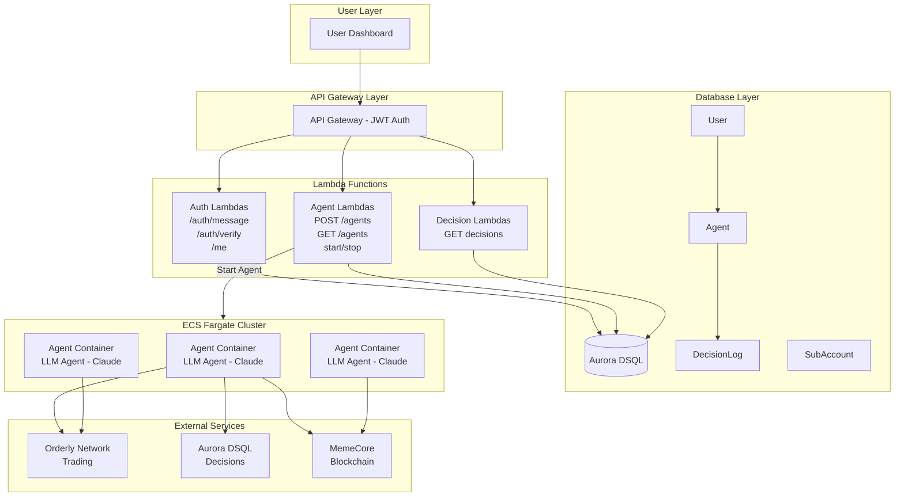
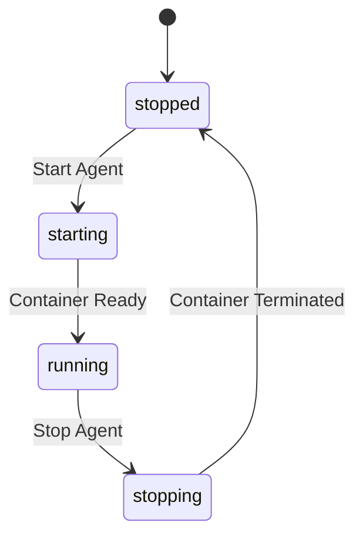
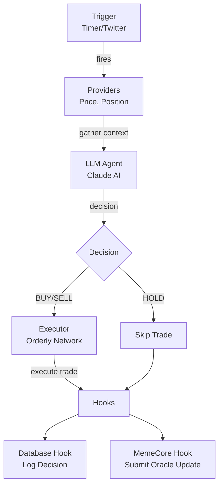
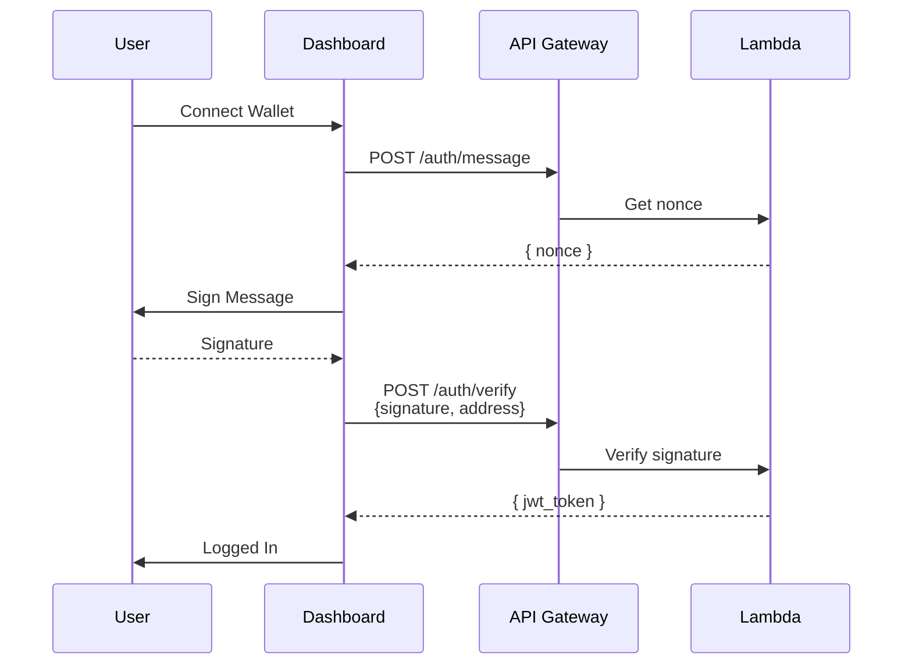
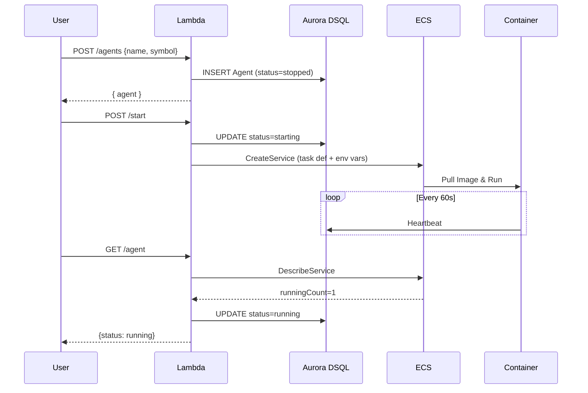
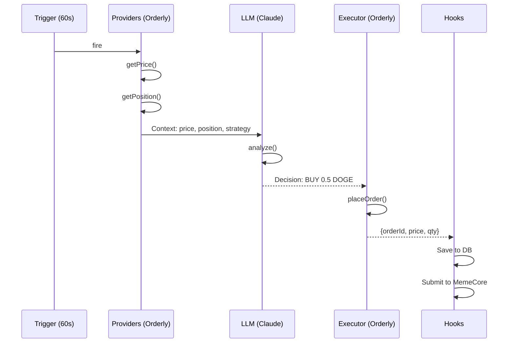
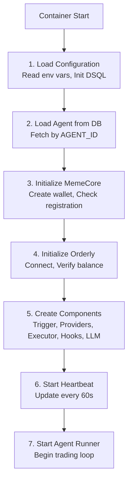
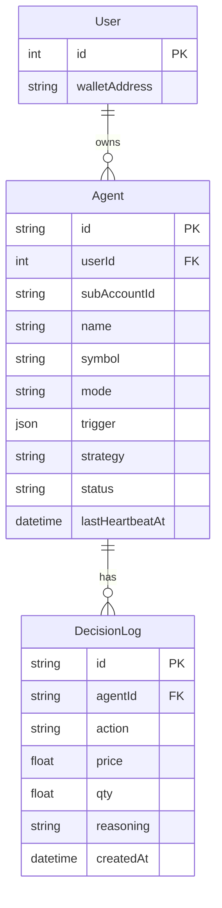

# MemePulse Agent Architecture

## Overview

MemePulse is an AI-powered trading agent platform that runs on AWS infrastructure. The system consists of two main components:

1. **AWS Lambda** - REST API for agent management
2. **ECS Fargate** - Container runtime for AI trading agents

### System Architecture



---

## AWS Lambda (API Layer)

### Directory Structure

```
apps/aws-lambda/src/
├── _lib/                    # Shared utilities
│   ├── agent-task.ts        # ECS service management
│   └── response.ts          # API response helpers
├── agent/
│   ├── domain/
│   │   ├── agent.ts         # Agent entity
│   │   ├── agent-status.ts  # Status enum
│   │   └── agent-repository.ts
│   ├── handlers/
│   │   ├── create.ts        # POST /agents
│   │   ├── start.ts         # POST /agents/{id}/start
│   │   ├── stop.ts          # POST /agents/{id}/stop
│   │   ├── get.ts           # GET /agents/{id}
│   │   ├── list.ts          # GET /agents
│   │   └── delete.ts        # DELETE /agents/{id}
│   └── infrastructure/
│       └── prisma-agent-repository.ts
├── auth/
│   └── handlers/
│       ├── message.ts       # POST /auth/message
│       ├── verify.ts        # POST /auth/verify
│       └── jwt-authorizer.ts
├── decision/
│   └── handlers/
│       └── list.ts          # GET /agents/{id}/decisions
└── user/
    └── handlers/
        ├── get-me.ts        # GET /me
        └── register-orderly.ts
```

### Agent Status Flow



| Status | Description |
|--------|-------------|
| `stopped` | Agent is not running |
| `starting` | ECS service created, waiting for task |
| `running` | ECS task is running |
| `stopping` | ECS service being deleted |

### Key Handlers

#### Start Agent (`start.ts`)
1. Validates agent exists and is stopped
2. Gets Orderly credentials from user
3. Creates ECS service with agent-specific task definition
4. Sets status to `starting`

#### Get Agent (`get.ts`)
1. Fetches agent from database
2. If status is `starting` or `stopping`, syncs with ECS service status
3. Updates database if status changed
4. Returns agent view

---

## ECS Agent Container

### Directory Structure

```
apps/agent/src/
├── index.ts              # Entry point
├── config.ts             # Environment config loader
├── agent-loader.ts       # Load agent from database
├── heartbeat.ts          # Periodic status update
├── decision-hook.ts      # Database decision logger
└── memecore-hook.ts      # MemeCore blockchain hook
```

### Agent Packages

```
packages/
├── agent/                # Core agent logic
│   └── src/
│       ├── agent-runner.ts    # Main execution loop
│       ├── llm-agent.ts       # Claude AI integration
│       └── types.ts
├── context/              # Context providers interface
├── trigger/              # Trigger interface (timer, twitter)
├── database/             # Prisma client & connector
└── external/
    ├── orderly/          # Orderly Network integration
    │   ├── rest-client.ts
    │   ├── executor.ts
    │   ├── price-provider.ts
    │   └── position-provider.ts
    ├── twitter/          # Twitter trigger
    └── memecore/         # MemeCore blockchain
        ├── client.ts
        ├── abi.ts
        └── types.ts
```

### Execution Flow



### Configuration

Environment variables passed to ECS container:

| Variable | Description |
|----------|-------------|
| `AGENT_ID` | Agent identifier |
| `ORDERLY_ACCOUNT_ID` | Orderly sub-account ID |
| `ORDERLY_PUBLIC_KEY` | Orderly API public key |
| `ORDERLY_SECRET_KEY` | Orderly API secret key |
| `ANTHROPIC_API_KEY` | Claude API key |
| `DSQL_ENDPOINT` | Aurora DSQL endpoint |
| `MEMECORE_ENABLED` | Enable MemeCore integration |
| `MEMECORE_RPC_URL` | MemeCore RPC endpoint |
| `MEMECORE_PRIVATE_KEY` | MemeCore wallet private key |

### Hooks System

Hooks are called after each decision:

```typescript
interface DecisionHook {
  onDecision(params: {
    agentId: string;
    decision: Decision;
    context: Context;
    result: ExecutionResult;
  }): Promise<void>;
}
```

**DatabaseDecisionHook**: Logs decisions to Aurora DSQL

**MemeCoreHook**: Submits price updates to MemeCore blockchain
- Converts decision to PriceReport
- Calls `submitUpdate` on Aggregator contract
- Includes price, volume, leverage, timestamp

### Heartbeat

The agent sends heartbeats every 60 seconds to update `lastHeartbeatAt` in the database. This allows the system to detect crashed agents.

---

## Interaction Flows

### 1. User Authentication Flow



### 2. Agent Lifecycle Flow



### 3. Agent Trading Loop



---

## Container Startup Sequence



---

## Database Schema



---

## Deployment

### Build & Push Agent Image

```bash
# Login to ECR
aws ecr get-login-password --region ap-northeast-2 | docker login --username AWS --password-stdin <account>.dkr.ecr.ap-northeast-2.amazonaws.com

# Build image
docker build --platform linux/arm64 -t <account>.dkr.ecr.ap-northeast-2.amazonaws.com/memepulse-agent:latest .

# Push image
docker push <account>.dkr.ecr.ap-northeast-2.amazonaws.com/memepulse-agent:latest
```

### Deploy CDK Stack

```bash
cd apps/cdk
npx cdk deploy
```

### Environment Variables

Set in `apps/cdk/env.json`:

```json
[
  { "DSQL_CLUSTER_ARN": "arn:aws:dsql:..." },
  { "DSQL_ENDPOINT": "xxx.dsql.ap-northeast-2.on.aws" },
  { "ANTHROPIC_API_KEY": "sk-ant-..." },
  { "MEMECORE_ENABLED": "true" },
  { "MEMECORE_RPC_URL": "https://rpc.insectarium.memecore.net" },
  { "MEMECORE_PRIVATE_KEY": "0x..." }
]
```
