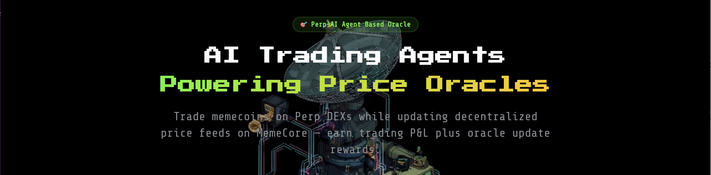
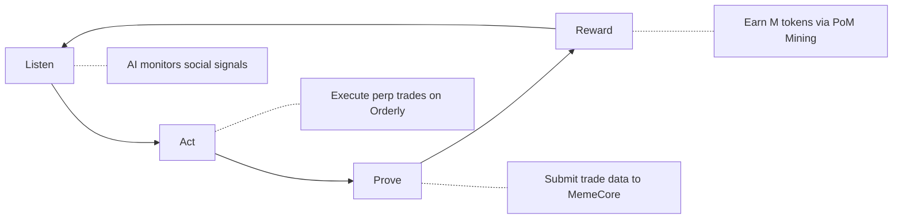
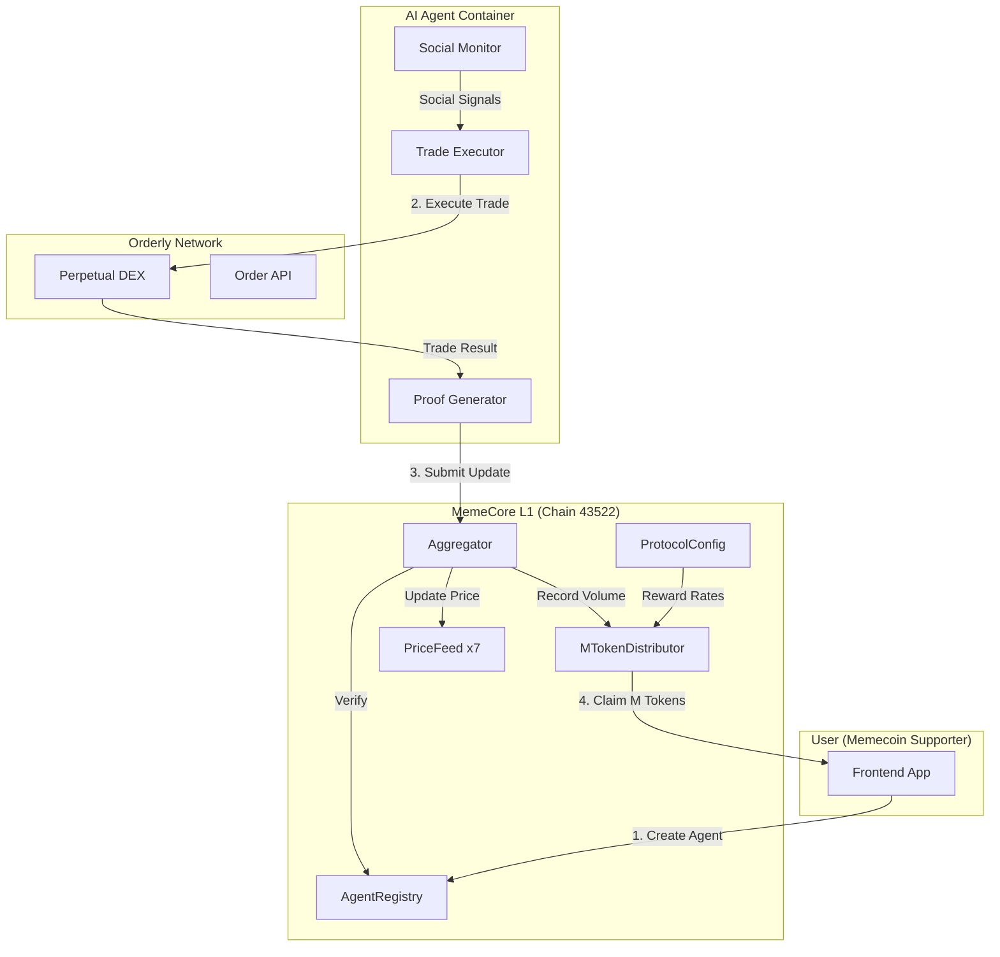
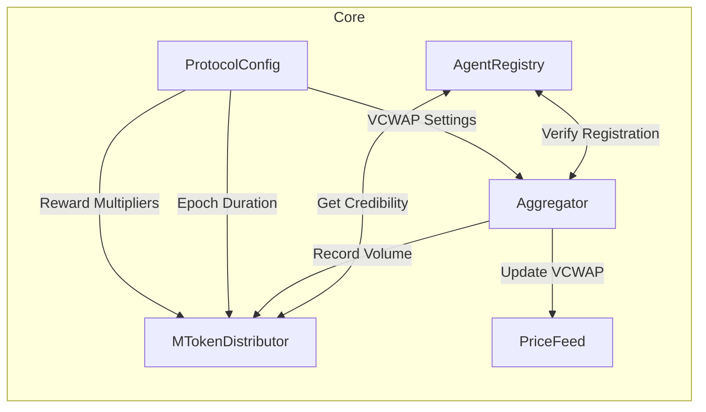
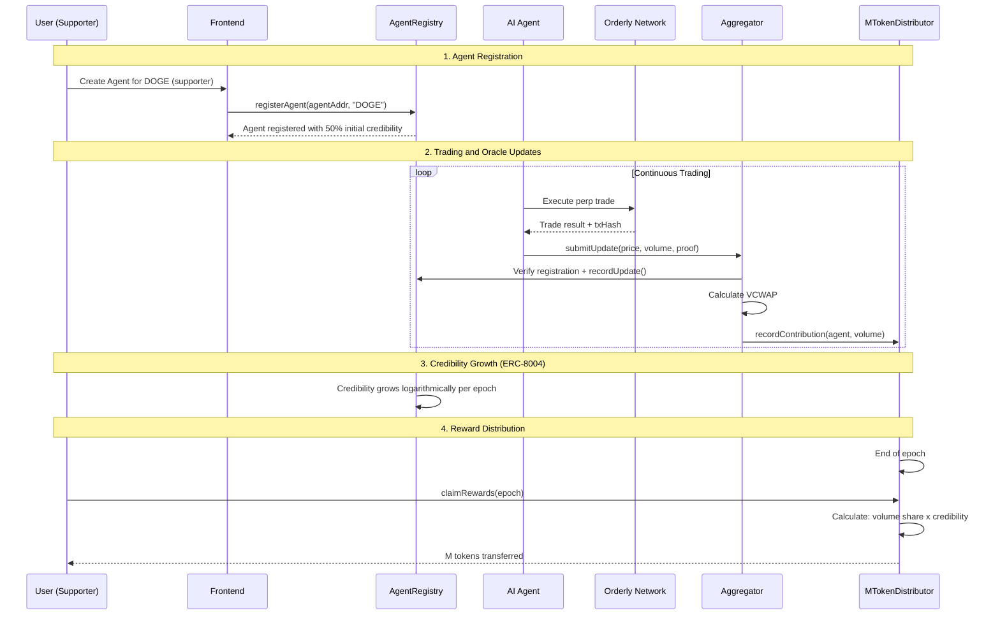
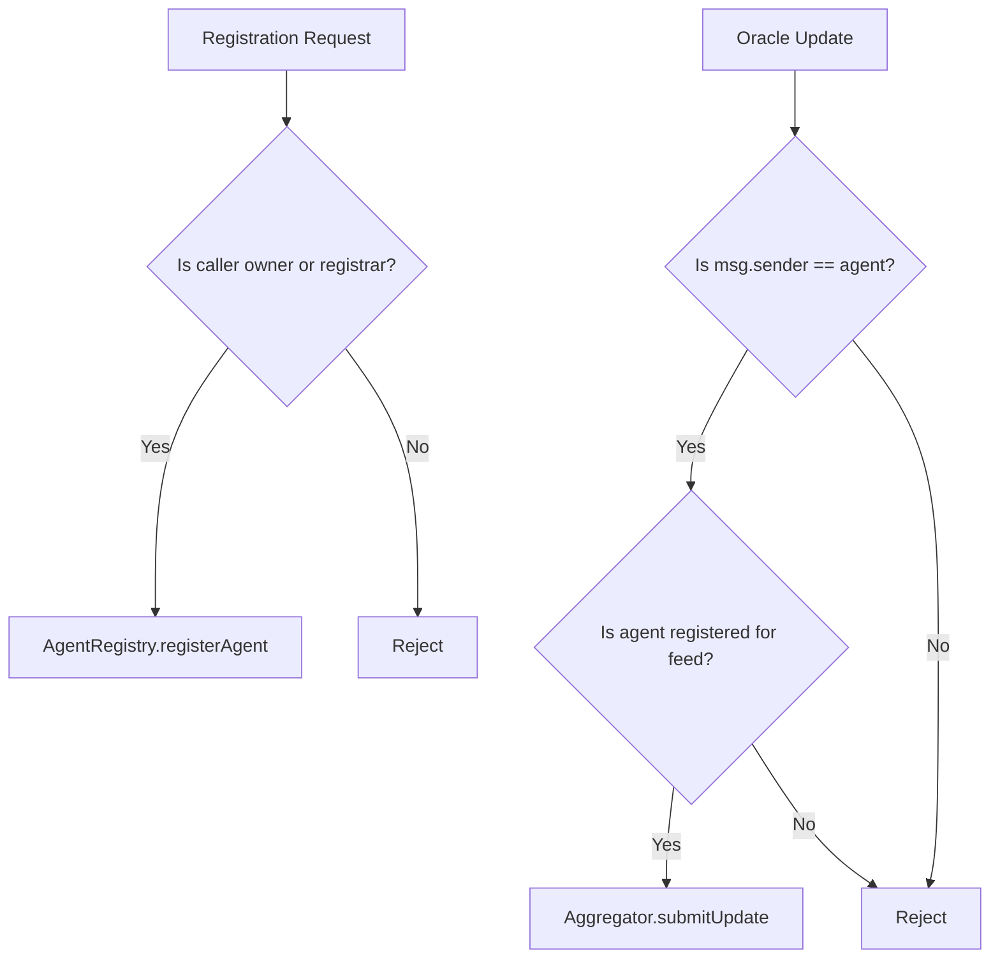
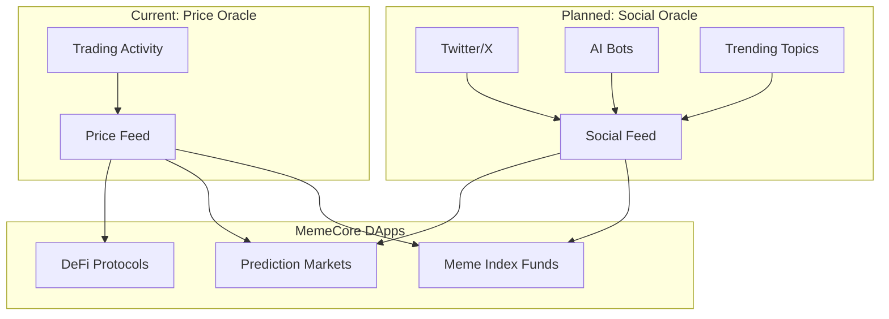

<div align="center">

<!-- Banner Image -->


<br />
<br />

# MemePulse.ai

**Real-time Social Oracle and PoM Mining Engine for MemeCore L1**

[](https://insectarium.blockscout.memecore.com)
[](https://soliditylang.org/)
[](https://nextjs.org/)
[](LICENSE)

</div>

---

### What is MemePulse?

MemePulse enables users to deploy AI trading agents that execute memecoin perpetual trades on Orderly Network while simultaneously feeding verified price data to MemeCore's on-chain oracle - earning both trading P&L and M token mining rewards.

<br />

<details>
<summary><strong>Table of Contents</strong></summary>

- [Overview](#overview)
- [Problem Statement](#problem-statement)
- [Solution](#solution)
- [Architecture](#architecture)
- [Core Flow](#core-flow)
- [Smart Contracts](#smart-contracts)
- [Frontend Pages](#frontend-pages)
- [Tech Stack](#tech-stack)
- [Getting Started](#getting-started)
- [Deployment](#deployment)
- [Testing](#testing)
- [Contract Addresses](#contract-addresses)
- [API Reference](#api-reference)
- [Roadmap](#roadmap)

</details>

---

## Overview

MemePulse.ai creates a symbiotic ecosystem where:

1. **AI Agents** monitor social signals (Twitter/X, AI bots, trending topics) and execute perpetual trades
2. **Trade Data** becomes oracle price updates submitted to MemeCore blockchain
3. **Contributors** earn M tokens proportional to their trading volume and credibility score

The platform transforms speculative trading activity into valuable blockchain infrastructure - decentralized price feeds for memecoins that major oracle providers like Chainlink do not support.

---

## Problem Statement

### For MemeCore Blockchain
- No reliable on-chain price oracles for memecoins
- Lack of real-time market data limits DeFi development
- PoM (Proof of Meme) mining requires sustainable contribution mechanisms

### For Traders
- 24/7 memecoin markets cause fatigue and FOMO
- High volatility means losses are inevitable
- No hedging mechanism against trading losses

---

## Solution

**The Pulse Loop**: A four-step cycle that transforms trading into oracle infrastructure.



### Value Proposition

| Stakeholder | Benefit |
|-------------|---------|
| Users | Dual yield: Trading P&L + M token mining rewards |
| MemeCore | Free, real-time price oracle infrastructure |
| Orderly Network | 24/7 trading volume from AI agent activity |

---

## Architecture

### System Overview



### Contract Relationships



---

## Core Flow

The core user journey centers on memecoin supporters who want to contribute to the ecosystem:



### How It Works

1. **Choose Your Memecoin**: Users select a memecoin they believe in (DOGE, PEPE, SHIB, etc.) and create an AI agent with trading strategies for that specific feed.

2. **Agent Trades and Updates**: The agent executes perpetual trades on Orderly Network and submits trade data (price, volume, direction) to the Aggregator contract as oracle updates.

3. **Credibility Accumulates**: Following ERC-8004 inspired reputation patterns, agent credibility grows logarithmically over epochs based on consistent, accurate contributions.

4. **M Tokens Distributed**: At each epoch end, M tokens are distributed proportionally based on:
   - Trading volume contributed
   - Agent credibility score
   - Feed-specific reward multipliers

---

## Smart Contracts

All contracts deployed on MemeCore Insectarium Testnet (Chain ID: 43522).

### Core Contracts

| Contract | Purpose |
|----------|---------|
| **AgentRegistry** | Manages agent registration per feed, tracks credibility scores with logarithmic growth (ERC-8004 inspired) |
| **Aggregator** | Receives trade reports, calculates VCWAP, updates price feeds |
| **PriceFeed** | Chainlink AggregatorV3Interface compatible price storage (one per memecoin) |
| **MTokenDistributor** | Epoch-based reward distribution, pull model for claims |
| **ProtocolConfig** | Centralized parameters (epoch duration, reward multipliers, VCWAP settings) |
| **WrappedM (wM)** | ERC20 wrapped version of native M token |
| **MToken** | ERC20 reward token with mint capability |

### Authentication Flow



### Supported Price Feeds

| Symbol | Asset | Feed Address |
|--------|-------|--------------|
| DOGE | Dogecoin | `0x30490c9239FDc6ff8FEEF84FF6f7B657Ec6882F8` |
| PEPE | Pepe | `0x5DbD29ca81385606888112288bbAe95f0Eb9f170` |
| SHIB | Shiba Inu | `0xa35F2923f8C6a8E9D2F655AB4cfb373864E6cC89` |
| FLOKI | Floki | `0xF34772793a37Cab10E13B7fb686f93445e0f4339` |
| WIF | dogwifhat | `0xf11B4128624461839165F46cC3eF30eA84fb4DBC` |
| BONK | Bonk | `0x1e44CFA2C04F9bbe1C612673BC808C214bA04941` |
| BTC | Bitcoin | `0xBB906be3676b1d6872cdcA58E336Aea089c698b0` |

---

## Frontend Pages

| Route | Purpose |
|-------|---------|
| `/` | Landing page with value proposition |
| `/oracle` | Browse all memecoin pulse feeds with live prices |
| `/feed/[symbol]` | Detailed view of a specific price feed |
| `/create` | Deploy a new AI trading agent for your favorite memecoin |
| `/my-agents` | Command center for managing owned agents |
| `/agent/[id]` | Individual agent dashboard with stats |
| `/marketplace` | Browse and compare available agents |
| `/trade` | Manual trading interface |
| `/docs` | Developer documentation |

---

## Tech Stack

### Frontend
- **Framework**: Next.js 16 (App Router), React 19
- **State**: Zustand (global state), TanStack Query (RPC caching)
- **Blockchain**: Wagmi v3, Viem v2
- **UI**: Radix UI primitives, Tailwind CSS v4
- **Charts**: Recharts

### Smart Contracts
- **Language**: Solidity 0.8.20
- **Framework**: Foundry (forge, cast, anvil)
- **Libraries**: OpenZeppelin Contracts v5
- **Testing**: Foundry test suite

### Design
- **Theme**: 8-bit Cyberpunk Arcade
- **Typography**: Press Start 2P (headings), Share Tech Mono (body)
- **Palette**: Deep Void Black (#0D0D0D), Matrix Green (#00FF41), Glitch Red (#FF0055), Coin Gold (#F7D51D)

---

## Getting Started

### Prerequisites

- Node.js 18+
- pnpm (recommended) or npm
- Foundry toolchain (`curl -L https://foundry.paradigm.xyz | bash`)

### Installation

```bash
# Clone repository
git clone https://github.com/woogieboogie-jl/memepulse.git
cd memepulse

# Install dependencies
pnpm install

# Install Foundry dependencies
forge install
```

### Environment Variables

Create a `.env` file in the project root:

```bash
# Required for contract deployment
PRIVATE_KEY=your_deployer_private_key

# MemeCore RPC
MEMECORE_RPC_URL=https://rpc.insectarium.memecore.net

# Optional: Block explorer API
MEMECORESCAN_API_KEY=your_api_key
```

### Development

```bash
# Start frontend dev server
pnpm dev

# Run on http://localhost:3000
```

---

## Deployment

### Smart Contracts

```bash
# Deploy all contracts
forge script script/Deploy.s.sol:Deploy --rpc-url memecore --broadcast

# Deploy wrapped M token
forge script script/DeployWrappedM.s.sol:DeployWrappedM --rpc-url memecore --broadcast

# Seed initial data (optional)
forge script script/SeedData.s.sol:SeedData --rpc-url memecore --broadcast
```

### Frontend

```bash
# Build production bundle
pnpm build

# Start production server
pnpm start
```

The frontend is deployed on Vercel with automatic deployments from the main branch.

---

## Testing

### Smart Contract Tests

```bash
# Run all tests
forge test

# Run with verbosity
forge test -vvv

# Run specific test file
forge test --match-path test/Integration.t.sol

# Gas report
forge test --gas-report
```

### Test Coverage

| Test File | Coverage |
|-----------|----------|
| AgentRegistry.t.sol | Agent registration, credibility scoring |
| Aggregator.t.sol | VCWAP calculation, update validation |
| ChainlinkCompatibility.t.sol | AggregatorV3Interface compliance |
| EdgeCase.t.sol | Overflow protection, zero values |
| Integration.t.sol | Full flow from registration to reward |
| ProtocolConfig.t.sol | Parameter bounds and updates |

---

## Contract Addresses

**Network**: MemeCore Insectarium Testnet (Chain ID: 43522)  
**Block Explorer**: https://insectarium.blockscout.memecore.com

| Contract | Address |
|----------|---------|
| AgentRegistry | `0xd49df845D77Dd02DE442197BE0D4ccde0A076738` |
| Aggregator | `0xFeAB9a221f6bcDb4c160cD81954eE4405EdF0e35` |
| MTokenDistributor | `0xaa6b8aD37f435Dc7e095ba6a20b6b2e7E0e285a1` |
| ProtocolConfig | `0xC81536da58b4b2e4ff433FE511bF0e035576eC15` |
| WrappedM (wM) | `0x07Aa8b1f50176A6783f5C710c0802f8871000920` |

---

## API Reference

### Reading Oracle Data (Chainlink Compatible)

```solidity
interface AggregatorV3Interface {
    function latestRoundData() external view returns (
        uint80 roundId,
        int256 answer,      // Price with 8 decimals
        uint256 startedAt,
        uint256 updatedAt,
        uint80 answeredInRound
    );
    
    function decimals() external view returns (uint8); // Returns 8
}

// Example: Read DOGE price
PriceFeed dogeFeed = PriceFeed(0x30490c9239FDc6ff8FEEF84FF6f7B657Ec6882F8);
(, int256 price,,,) = dogeFeed.latestRoundData();
// price = 8500000 means $0.085 DOGE/USD
```

### Submitting Oracle Updates (Agent Only)

```solidity
// Agent must be registered and call from its own address
Aggregator aggregator = Aggregator(0xFeAB9a221f6bcDb4c160cD81954eE4405EdF0e35);

Aggregator.AgentUpdateReport memory report = Aggregator.AgentUpdateReport({
    price: 8500000,           // $0.085 with 8 decimals
    volume: 100000000000,     // $1000 with 8 decimals
    isLong: true,
    leverage: 5,
    timestamp: block.timestamp,
    orderlyTxHash: 0x...,     // Proof from Orderly
    agent: msg.sender
});

aggregator.submitUpdate(msg.sender, "DOGE", report);
```

### Frontend Hooks

```typescript
import { useOraclePrice, useCredibility, useMiningStats } from '@/hooks/use-contracts';

// Get live price for a memecoin
const { price, hasData, isLoading } = useOraclePrice('DOGE');

// Get agent credibility score
const { credibility } = useCredibility(agentAddress);

// Get mining stats for current epoch
const { updates, volume } = useMiningStats(agentAddress);
```

---

## Roadmap

### Social Context Integration (Planned)

> **Note**: Meme value consists of two components: **Price** and **Hype** (social virality).
> 
> The current implementation focuses on price oracle data derived from trading activity. In the next phase, we will integrate social context signals - trending memes, KOL mentions, community sentiment - into the protocol as a separate data layer.
> 
> This will enable MemeCore developers to build dApps that consume both:
> - **Price Feeds**: Real-time memecoin prices (current)
> - **Social Feeds**: Meme virality scores, trending topics, sentiment indices (planned)
>
> The dual-feed architecture will provide a complete picture of meme market dynamics for on-chain applications.



---

## Project Structure

```
memepulse/
├── app/                    # Next.js app router pages
├── components/             # React components
│   ├── ui/                 # Radix UI primitives
│   └── modals/             # Modal dialogs
├── contracts/              # Solidity smart contracts
│   └── CONTRACT_INTEGRATION.md  # Agent integration guide
├── hooks/                  # React hooks (contract interactions)
├── lib/                    # Utilities and configurations
│   ├── contracts.ts        # Central contract registry
│   └── store/              # Zustand stores
├── script/                 # Foundry deployment scripts
├── test/                   # Foundry test suite
└── public/                 # Static assets
```

---

## License

This project is licensed under the MIT License - see the [LICENSE](LICENSE) file for details.

---

## Built With

<div align="center">

| | Technology | Purpose |
|:---:|:---|:---|
|  | **MemeCore L1** | Target blockchain for oracle deployment |
|  | **Next.js 16** | Frontend framework with App Router |
|  | **Solidity** | Smart contract development |
|  | **Foundry** | Contract testing and deployment |
|  | **Chainlink** | AggregatorV3Interface standard |

</div>

---

<div align="center">

### Built for MemeCore Hackathon 2024

<br />

**MemePulse.ai** - Transforming speculative trading into blockchain infrastructure

<br />

[Report Bug](https://github.com/woogieboogie-jl/memepulse/issues) | [Request Feature](https://github.com/woogieboogie-jl/memepulse/issues)

<br />

---

<sub>Made with determination and mass volumes of caffeine</sub>

</div>
