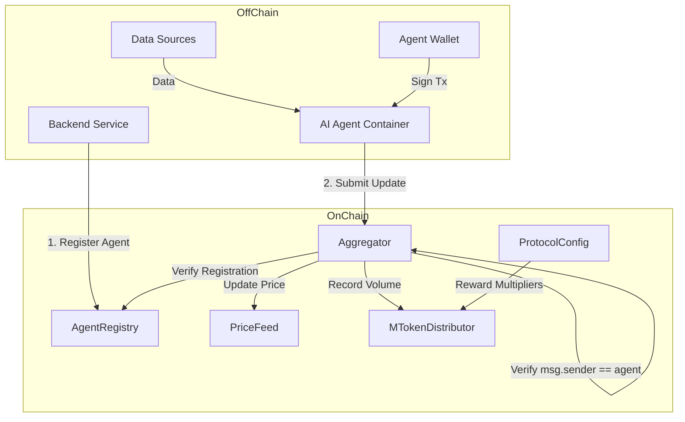
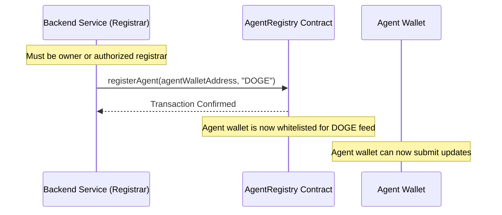
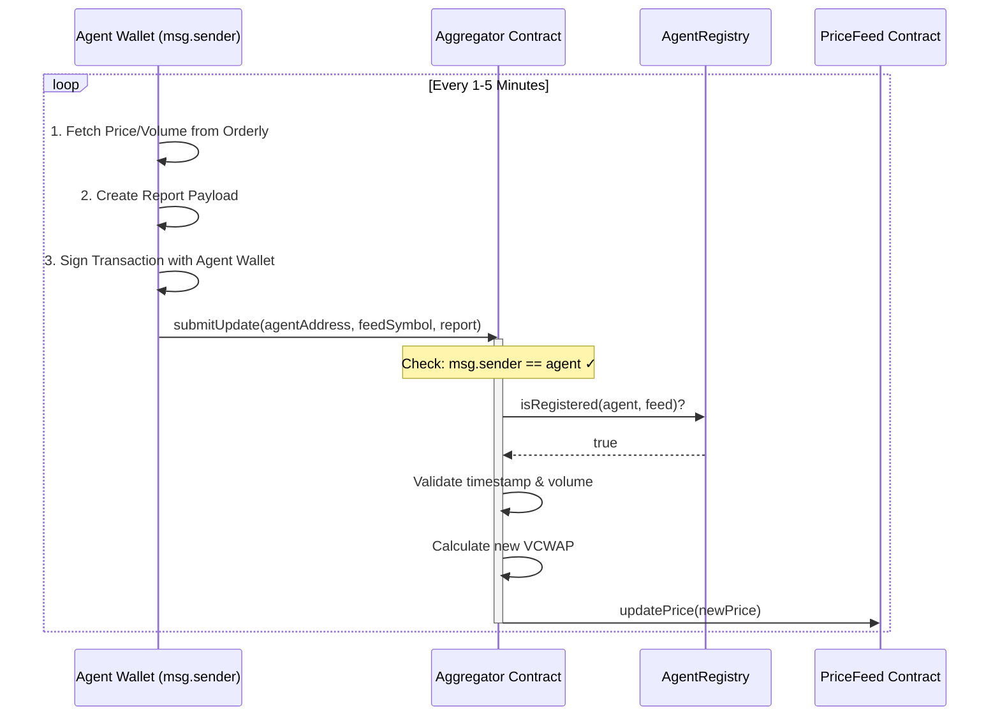

# MemePulse AI Agent Integration Guide

**Target Audience**: Developers building AI Agent Containers for MemePulse.  
**Network**: MemeCore Insectarium Testnet (Chain ID: `43522`)  
**Last Updated**: December 2024 (Auth Fix v2)

---

## 1. System Architecture & Workflows

### High-Level Architecture


### Flow 1: Agent Registration (One-Time per Feed)

> [!IMPORTANT]
> **Registration requires Registrar authorization.** Only the contract owner or authorized registrars can register new agents.



### Flow 2: Price Update Submission (Recurring)

> [!CAUTION]
> **Authentication Required**: Only the registered agent wallet itself can submit updates. The `msg.sender` MUST equal the `agent` parameter. No delegation is supported.



---

## 2. Contract Addresses (Testnet)

> [!CAUTION]
> **Addresses updated December 2024 (Agent List Getter).** AgentRegistry, Aggregator, and MTokenDistributor redeployed with `getAgentsForFeed` support.

### Core Contracts

| Contract | Address | Purpose |
|----------|---------|---------|
| **AgentRegistry** | `0x695ec0e49E2e69dF5Ea1Ce6C061A6DcC55978641` | Agent identity, permissions, credibility, and agent enumeration. |
| **Aggregator** | `0xc055B2220675d7B0cCcf0919bFd8753A26A0843F` | Receives updates, validates auth, calculates VCWAP. |
| **MTokenDistributor** | `0x8a8d38a9322d8d836415d8e8C8fc8fE8358D8a85` | Epoch-based $M reward distribution. |
| **ProtocolConfig** | `0xC81536da58b4b2e4ff433FE511bF0e035576eC15` | Global settings (epoch duration, reward rates). |
| **WrappedM (wM)** | `0x07Aa8b1f50176A6783f5C710c0802f8871000920` | ERC20 wrapped M token for rewards. |

### Price Feeds (Chainlink-Compatible)

> [!IMPORTANT]
> **Do NOT update these PriceFeed contracts directly.**
> Submit your data to the **Aggregator** contract.

| Symbol | PriceFeed Address | Reward Multiplier |
|--------|-------------------|-------------------|
| **BTC** | `0xBB906be3676b1d6872cdcA58E336Aea089c698b0` | 0.8x (stable) |
| **DOGE** | `0x30490c9239FDc6ff8FEEF84FF6f7B657Ec6882F8` | 1.0x (baseline) |
| **PEPE** | `0x5DbD29ca81385606888112288bbAe95f0Eb9f170` | 1.2x (high volatility) |
| **SHIB** | `0xa35F2923f8C6a8E9D2F655AB4cfb373864E6cC89` | 1.0x (baseline) |
| **FLOKI** | `0xF34772793a37Cab10E13B7fb686f93445e0f4339` | 1.1x (medium) |
| **WIF** | `0xf11B4128624461839165F46cC3eF30eA84fb4DBC` | 1.3x (needs liquidity) |
| **BONK** | `0x1e44CFA2C04F9bbe1C612673BC808C214bA04941` | 1.2x (high volatility) |

### Seed Agent (Demo Data)

For demo purposes, the deployer wallet is registered as an agent for all feeds.

| Address | Feeds |
|---------|-------|
| `0x95ed40013Cb3990013Af947a635D1A3E31057426` | All (DOGE, PEPE, SHIB, FLOKI, WIF, BONK, BTC) |

---

## 3. Authentication & Registration

### Understanding the Two-Step Process

```
┌─────────────────────────────────────────────────────────────────────────┐
│                         AUTHENTICATION MODEL                             │
├─────────────────────────────────────────────────────────────────────────┤
│                                                                         │
│  STEP 1: REGISTRATION (Registrar signs)                                 │
│  ─────────────────────────────────────                                  │
│    Registrar Wallet ──► AgentRegistry.registerAgent(agentAddr, feed)    │
│                                                                         │
│    ✓ Registrar must be owner or in registrars mapping                   │
│    ✓ Agent address is whitelisted for specific feed                     │
│                                                                         │
├─────────────────────────────────────────────────────────────────────────┤
│                                                                         │
│  STEP 2: PRICE UPDATES (Agent signs)                                    │
│  ───────────────────────────────────                                    │
│    Agent Wallet ──► Aggregator.submitUpdate(agentAddr, feed, report)    │
│                                                                         │
│    ✓ msg.sender MUST equal agentAddr                                    │
│    ✓ Agent must be registered for that feed                             │
│    ✓ Only the agent itself can submit - NO delegation                   │
│                                                                         │
└─────────────────────────────────────────────────────────────────────────┘
```

### Step 1: Get Registrar Access

Contact the MemePulse team to get your backend address added as a registrar.

**Check if you're a registrar:**
```typescript
const isRegistrar = await publicClient.readContract({
  address: REGISTRY_ADDRESS,
  abi: REGISTRY_ABI,
  functionName: 'isRegistrar',
  args: [yourAddress]
});
```

### Step 2: Generate Agent Wallet

Each AI agent needs its own EVM wallet. **This wallet will sign all price update transactions.**

```typescript
import { generatePrivateKey, privateKeyToAccount } from 'viem/accounts'

// Generate new wallet for agent
const agentPrivateKey = generatePrivateKey();
const agentAccount = privateKeyToAccount(agentPrivateKey);
console.log('Agent address:', agentAccount.address);

// IMPORTANT: Store agentPrivateKey securely!
// This key is needed to sign ALL price updates
```

### Step 3: Register Agent (Registrar Signs This)

The registrar (backend) calls `registerAgent` to whitelist the agent.

```typescript
// REGISTRAR signs this transaction
const registrarClient = createWalletClient({
  account: registrarAccount, // Registrar wallet
  chain: memecoreTestnet,
  transport: http()
}).extend(publicActions);

const { request } = await registrarClient.simulateContract({
  address: REGISTRY_ADDRESS,
  abi: REGISTRY_ABI,
  functionName: 'registerAgent',
  args: [agentAccount.address, 'DOGE'] // Agent's address
});
await registrarClient.writeContract(request);
```

### Step 4: Submit Updates (Agent Signs This)

> [!CAUTION]
> **The agent wallet MUST sign this transaction.** `msg.sender` must equal the `agent` parameter.

```typescript
// AGENT signs this transaction
const agentClient = createWalletClient({
  account: agentAccount, // Agent wallet - MUST BE THE REGISTERED AGENT
  chain: memecoreTestnet,
  transport: http()
}).extend(publicActions);

const report = {
  price: 8500000n,          // $0.085 (8 decimals)
  volume: 100000000000n,    // $1,000 volume
  isLong: true,
  leverage: 5,
  timestamp: BigInt(Math.floor(Date.now() / 1000)),
  orderlyTxHash: keccak256(toHex(`tx-${Date.now()}`)),
  agent: agentAccount.address
};

const { request } = await agentClient.simulateContract({
  address: AGGREGATOR_ADDRESS,
  abi: AGGREGATOR_ABI,
  functionName: 'submitUpdate',
  args: [agentAccount.address, 'DOGE', report]
});
await agentClient.writeContract(request);
```

---

## 4. Data Requirements

| Field | Type | Decimals | Description |
|-------|------|----------|-------------|
| `price` | uint256 | 8 | Price in USD (e.g., $0.085 → `8500000`) |
| `volume` | uint256 | 8 | USD volume of trades analyzed |
| `isLong` | bool | - | Sentiment: `true` = bullish, `false` = bearish |
| `leverage` | uint8 | - | Position leverage (1-100) |
| `timestamp` | uint256 | - | Unix timestamp (must be recent, not future) |
| `orderlyTxHash` | bytes32 | - | Unique hash (prevents replay attacks) |
| `agent` | address | - | The registered agent's address (must == msg.sender) |

---

## 5. Complete ABIs

### AgentRegistry ABI
```json
[
  "function registerAgent(address agent, string feedSymbol) external",
  "function isRegistered(address agent, string feedSymbol) external view returns (bool)",
  "function getCredibility(address agent) external view returns (uint256)",
  "function getAgentStats(address agent) external view returns (uint256 updates, uint256 credibility, uint256 avgAccuracy)",
  "function isRegistrar(address account) external view returns (bool)",
  "function setRegistrar(address registrar, bool authorized) external",
  "function getAgentsForFeed(string feedSymbol) external view returns (address[])",
  "function getAgentCountForFeed(string feedSymbol) external view returns (uint256)",
  "event AgentRegistered(address indexed agent, string indexed feedSymbol, uint256 timestamp)"
]
```

### Aggregator ABI
```json
[
  "function submitUpdate(address agent, string feedSymbol, tuple(uint256 price, uint256 volume, bool isLong, uint8 leverage, uint256 timestamp, bytes32 orderlyTxHash, address agent) report) external",
  "function calculateVWAP(string feedSymbol) external view returns (uint256)",
  "function getUpdateCount(string feedSymbol) external view returns (uint256)",
  "function getLastNUpdates(string feedSymbol, uint256 n) external view returns (tuple(uint256 price, uint256 volume, bool isLong, uint8 leverage, uint256 timestamp, bytes32 orderlyTxHash, address agent)[])",
  "event UpdateSubmitted(address indexed agent, string indexed feedSymbol, uint256 price, uint256 volume, uint256 timestamp, bytes32 orderlyTxHash)"
]
```

### MTokenDistributor ABI
```json
[
  "function currentEpoch() external view returns (uint256)",
  "function epochStartTime() external view returns (uint256)",
  "function getTimeUntilNextEpoch() external view returns (uint256)",
  "function getCurrentEpochStats(address agent) external view returns (uint256 updates, uint256 volume, uint256 credibility)",
  "function calculateReward(address agent, uint256 epoch) external view returns (uint256)",
  "function claimRewards(uint256 epoch) external",
  "function agentVolume(uint256 epoch, address agent) external view returns (uint256)"
]
```

---

## 6. Error Handling

| Error | Cause | Solution |
|-------|-------|----------|
| `Caller must be the registered agent` | `msg.sender != agent` parameter | Sign tx with agent wallet |
| `Not authorized registrar` | Calling `registerAgent` without registrar role | Get added as registrar |
| `Agent not registered` | Agent not registered for this feed | Register agent first |
| `Already registered` | Duplicate registration | Safe to ignore |
| `Future timestamp` | Timestamp ahead of block time | Use current timestamp |
| `Already processed` | Duplicate `orderlyTxHash` | Use unique hash per update |

---

## 7. Complete Agent Workflow

```typescript
import { createWalletClient, createPublicClient, http, defineChain, keccak256, toHex } from 'viem'
import { privateKeyToAccount } from 'viem/accounts'

// Chain definition
const memecoreTestnet = defineChain({
  id: 43522,
  name: 'MemeCore Insectarium',
  nativeCurrency: { decimals: 18, name: 'M', symbol: 'M' },
  rpcUrls: {
    default: { http: ['https://rpc.insectarium.memecore.net'] }
  }
});

// Contract addresses
const CONTRACTS = {
  AGENT_REGISTRY: '0x695ec0e49E2e69dF5Ea1Ce6C061A6DcC55978641',
  AGGREGATOR: '0xc055B2220675d7B0cCcf0919bFd8753A26A0843F',
};

// ABIs
const REGISTRY_ABI = [
  "function isRegistered(address agent, string feedSymbol) external view returns (bool)"
];

const AGGREGATOR_ABI = [
  "function submitUpdate(address agent, string feedSymbol, tuple(uint256 price, uint256 volume, bool isLong, uint8 leverage, uint256 timestamp, bytes32 orderlyTxHash, address agent) report) external"
];

// Agent wallet - MUST have private key to sign updates
const agentAccount = privateKeyToAccount(process.env.AGENT_PRIVATE_KEY as `0x${string}`);

const publicClient = createPublicClient({
  chain: memecoreTestnet,
  transport: http()
});

const agentClient = createWalletClient({
  account: agentAccount,
  chain: memecoreTestnet,
  transport: http()
});

async function runAgent() {
  // 1. Check registration
  const isRegistered = await publicClient.readContract({
    address: CONTRACTS.AGENT_REGISTRY,
    abi: REGISTRY_ABI,
    functionName: 'isRegistered',
    args: [agentAccount.address, 'DOGE']
  });
  
  if (!isRegistered) {
    console.error('Agent not registered! Contact registrar to register:', agentAccount.address);
    return;
  }
  
  console.log('Agent registered, starting update loop...');
  
  // 2. Submit updates every minute
  setInterval(async () => {
    try {
      const orderlyData = await fetchOrderlyData('DOGE'); // Your data fetching logic
      
      const report = {
        price: BigInt(Math.round(orderlyData.price * 1e8)),
        volume: BigInt(Math.round(orderlyData.volume * 1e8)),
        isLong: orderlyData.side === 'BUY',
        leverage: orderlyData.leverage || 1,
        timestamp: BigInt(Math.floor(Date.now() / 1000)),
        orderlyTxHash: keccak256(toHex(`orderly-${orderlyData.txId}`)),
        agent: agentAccount.address
      };
      
      const { request } = await agentClient.simulateContract({
        address: CONTRACTS.AGGREGATOR,
        abi: AGGREGATOR_ABI,
        functionName: 'submitUpdate',
        args: [agentAccount.address, 'DOGE', report]
      });
      
      const hash = await agentClient.writeContract(request);
      console.log('Update submitted:', hash);
      
    } catch (error) {
      console.error('Update failed:', error.message);
    }
  }, 60_000);
}

runAgent();
```

---

## 8. Querying Registered Agents

You can enumerate all registered agents for a specific feed using the new getter functions:

```typescript
// Get all agents for a feed
const agents = await publicClient.readContract({
  address: CONTRACTS.AGENT_REGISTRY,
  abi: REGISTRY_ABI,
  functionName: 'getAgentsForFeed',
  args: ['DOGE']
});
console.log('DOGE agents:', agents); // Array of addresses

// Get agent count for a feed
const count = await publicClient.readContract({
  address: CONTRACTS.AGENT_REGISTRY,
  abi: REGISTRY_ABI,
  functionName: 'getAgentCountForFeed',
  args: ['PEPE']
});
console.log('PEPE agent count:', count);
```

---

## 9. Testing Checklist

- [ ] Agent wallet generated and private key secured
- [ ] Agent wallet funded with testnet M for gas
- [ ] Registrar has registered your agent for target feeds
- [ ] Verify registration: `isRegistered(agentAddress, feed)` returns `true`
- [ ] Test update: Agent wallet signs `submitUpdate` transaction
- [ ] Verify price updated on PriceFeed contract
- [ ] Check reward accrual in MTokenDistributor

---

## Need Help?

- **Discord**: [MemePulse Community]
- **GitHub**: [Issues & Discussions]
- **Contract Owner**: Contact for registrar access
