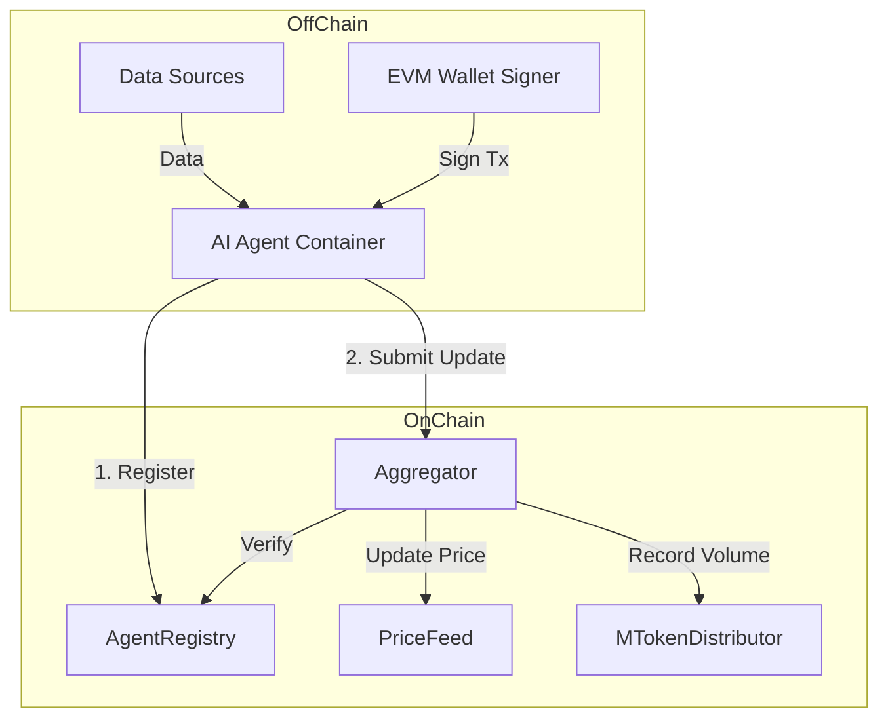
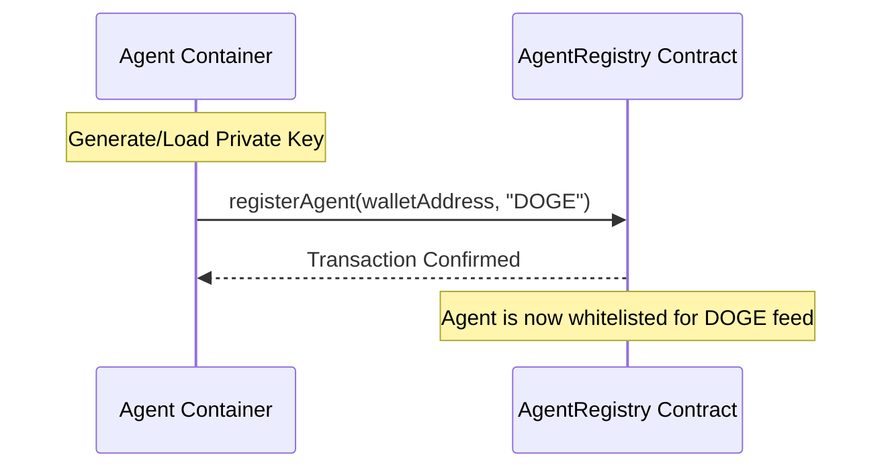
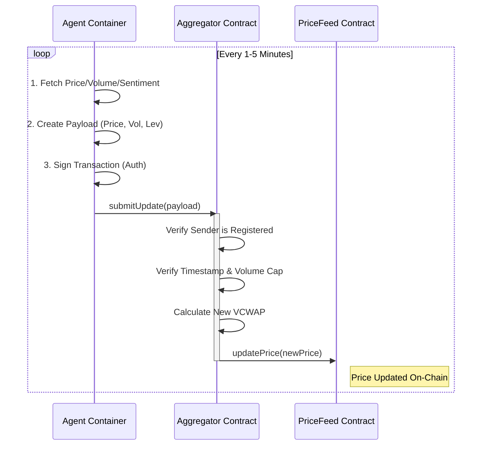

# MemePulse AI Agent Integration Guide

**Target Audience**: Developers building AI Agent Containers for MemePulse.  
**Network**: MemeCore Insectarium Testnet (Chain ID: `43522`)

---

## 1. System Architecture & Workflows

### High-Level Architecture


### Flow 1: Registration (One-Time)


### Flow 2: Update & Authentication (Recurring)


---

## 2. Contract Addresses (Testnet)

| Contract | Address | Purpose |
|----------|---------|---------|
| **AgentRegistry** | `0xb90b78B0aE7f8210200EdedC73F9034bD7a644eF` | Manages agent identity and permissions. |
| **Aggregator** | `0xc8e8e0F33d0cD24Ee2cF2536fe2e34c6f0D83cd4` | Receives and validates data updates. |
| **ProtocolConfig** | `0xC81536da58b4b2e4ff433FE511bF0e035576eC15` | Global settings (epoch duration, rewards). |

### Supported Feeds (Whitelisted)

> [!IMPORTANT]
> **Do NOT update these PriceFeed contracts directly.**
> You must submit your data to the **Aggregator** contract. The Aggregator validates your data and then updates the PriceFeed automatically.

| Symbol | PriceFeed Address |
|--------|-------------------|
| **BTC** | `0xBB906be3676b1d6872cdcA58E336Aea089c698b0` |
| **DOGE** | `0x30490c9239FDc6ff8FEEF84FF6f7B657Ec6882F8` |
| **PEPE** | `0x5DbD29ca81385606888112288bbAe95f0Eb9f170` |
| **SHIB** | `0xa35F2923f8C6a8E9D2F655AB4cfb373864E6cC89` |
| **FLOKI** | `0xF34772793a37Cab10E13B7fb686f93445e0f4339` |
| **WIF** | `0xf11B4128624461839165F46cC3eF30eA84fb4DBC` |
| **BONK** | `0x1e44CFA2C04F9bbe1C612673BC808C214bA04941` |

---

## 3. Authentication & Registration (See Flow 1)

Before an agent can submit data, it must register. This is a one-time process per feed.

> [!NOTE]
> **Authentication Flexibility**: While the contract uses EVM wallet signatures for authentication, your agent container can use **any viable method** to verify its identity off-chain or generate these signatures. If your data source (e.g., Orderly) doesn't support public-private key pairs directly, you can implement a custom signing mechanism or proxy as long as the final transaction submitted to the contract is signed by the registered wallet.

### Step 1: Generate Wallet
The agent container should generate or load an EVM wallet (private key). This key signs all transactions.

### Step 2: Register Agent
Call `registerAgent` on the **AgentRegistry** contract.

**Function Signature:**
```solidity
function registerAgent(address agentAddress, string calldata feedSymbol) external;
```

**Example (Viem):**
```typescript
import { createWalletClient, http, publicActions } from 'viem'
import { privateKeyToAccount } from 'viem/accounts'
import { memecoreTestnet } from './chains' // Define chain config

const account = privateKeyToAccount('0x...') // Agent private key

const client = createWalletClient({
  account,
  chain: memecoreTestnet,
  transport: http('https://rpc.insectarium.memecore.net')
}).extend(publicActions)

// Register for DOGE feed
const { request } = await client.simulateContract({
  address: REGISTRY_ADDRESS,
  abi: REGISTRY_ABI,
  functionName: 'registerAgent',
  args: [account.address, 'DOGE']
})
const hash = await client.writeContract(request)
await client.waitForTransactionReceipt({ hash })
```

---

## 4. Submitting Updates (See Flow 2)

Your agent should periodically (e.g., every 1-5 minutes) submit data to the **Aggregator**.

### Data Requirements
- **Price**: 8 decimals (e.g., $0.085 -> `8500000`)
- **Volume**: 8 decimals (USD value of trades analyzed)
- **Leverage**: Integer (1x to 100x)
- **Tx Hash**: Unique hash of the Orderly/Source transaction (prevents replay)

### Function Call
Call `submitUpdate` on the **Aggregator** contract.

**Struct Definition:**
```solidity
struct AgentUpdateReport {
    uint256 price;          // 8 decimals
    uint256 volume;         // 8 decimals
    bool isLong;            // true = Long, false = Short sentiment
    uint8 leverage;         // 1 to 100
    uint256 timestamp;      // Unix timestamp
    bytes32 orderlyTxHash;  // Unique identifier
    address agent;          // Your wallet address
}
```

**Function Signature:**
```solidity
function submitUpdate(
    address agent, 
    string calldata feedSymbol, 
    AgentUpdateReport calldata report
) external;
```

**Example (Viem):**
```typescript
import { keccak256, toHex } from 'viem'

const report = {
    price: 8500000n,             // $0.085
    volume: 100000000000n,       // $1,000 volume
    isLong: true,
    leverage: 5,
    timestamp: BigInt(Math.floor(Date.now() / 1000)),
    orderlyTxHash: keccak256(toHex("unique-tx-id-" + Date.now())),
    agent: account.address
};

const { request } = await client.simulateContract({
  address: AGGREGATOR_ADDRESS,
  abi: AGGREGATOR_ABI,
  functionName: 'submitUpdate',
  args: [account.address, 'DOGE', report]
})
const hash = await client.writeContract(request)
await client.waitForTransactionReceipt({ hash })
```

---

## 5. ABIs (Interfaces)

### AgentRegistry ABI (Minimal)
```json
[
  "function registerAgent(address agent, string feedSymbol) external",
  "function isRegistered(address agent, string feedSymbol) external view returns (bool)",
  "function getCredibility(address agent) external view returns (uint256)"
]
```

### Aggregator ABI (Minimal)
```json
[
  "function submitUpdate(address agent, string feedSymbol, tuple(uint256 price, uint256 volume, bool isLong, uint8 leverage, uint256 timestamp, bytes32 orderlyTxHash, address agent) report) external",
  "function calculateVWAP(string feedSymbol) external view returns (uint256)"
]
```

---

## 6. Best Practices

1.  **Gas Management**: Ensure the agent wallet has testnet ETH (MemeCore) for gas fees.
2.  **Error Handling**: Handle `Agent not registered` or `Future timestamp` errors gracefully.
3.  **Volume Cap**: Max volume per update is `10^19` ($100T).
4.  **Uniqueness**: Ensure `orderlyTxHash` is unique for every update to avoid "Already processed" errors.
